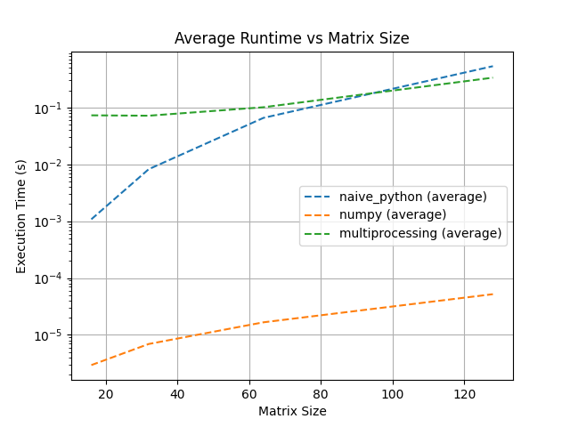
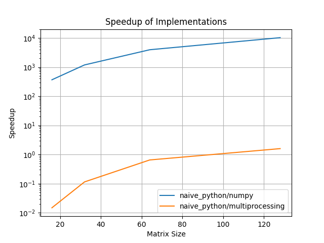
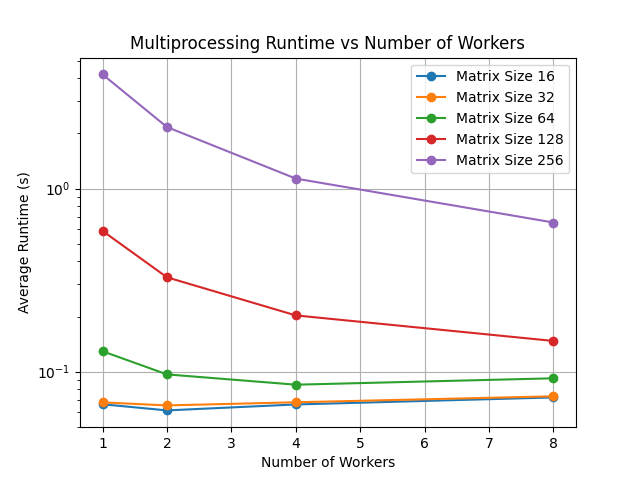
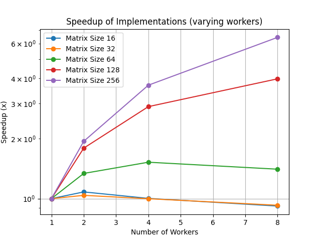

# Matrix Multiplication Performance Benchmark

## Overview

This project benchmarks different matrix multiplication implementations and compares their correctness and performance.

The goal is to understand how implementation choices affect runtime, scaling behaviour, and speedup as matrix size increases.

## Motivation

Matrix multiplication is a core operation in scientific computing, machine learning, numerical simulation, and high performance computing.

This project uses it as a first HPC-style benchmark to practice:

- correctness testing
- performance measurement
- experiment automation
- runtime comparison
- scaling analysis

## Implementations

This project currently includes:

1. Naive Python implementation  
   - Uses explicit triple nested loops
   - Serves as the baseline implementation

2. NumPy implementation  
   - Uses optimized library-backed matrix multiplication
   - Serves as the optimized reference implementation

3. Multiprocessing implementation  
   - Splits matrix computation across CPU workers
   - Used to study parallel overhead and scaling

## Repository Structure

```text
hpc-matrix-multiplication-benchmark/
├── src/
│   ├── implementations.py
│   ├── benchmark.py
│   ├── plot_results.py
│   ├── worker_scaling.py
│   └── plot_worker_scaling.py
├── tests/
│   └── test_implementations.py
├── experiments/
├── scripts/
├── results/
│   ├── raw/
│   ├── logs/
│   └── plots/
├── README.md
├── requirements.txt
└── .gitignore
```

## Setup

Create and activate a virtual environment:

```sh
uv venv
source .venv/bin/activate
```

Install dependencies:

```sh
uv pip install -r requirements.txt
```

## Running Tests
Run the correctness tests:

```sh
python -m unittest discover -s tests -v
```

The tests verify that the implementations produce correct results for:

- square matrices
- rectangular matrices
- identity matrices
- zero matrices

## Running Benchmarks

Run the benchmark:

```sh
python -m src.benchmark
```

Results are saved to:

```text
results/raw/benchmark_results.csv
```

## Plotting Results

Generate comparison and speedup plots:

```sh
python src/plot_results.py
```

Plots are saved to:

```text
results/plots/comparison_plot.png
results/plots/speedup_plot.png
```

## Benchmark Design

The benchmark will compare implementations by varying matrix size.

For each matrix size:

1. Generate input matrices
2. Run each implementation
3. Measure execution time
4. Repeat multiple times
5. Validate correctness against NumPy
6. Save results to CSV

Planned metrics:

- runtime (done)
- average runtime (done)
- speedup versus naive baseline (done)
- correctness flag (done)

## Worker Scaling Experiment

In addition to comparing implementations, this project evaluates how the multiprocessing implementation scales with increasing numbers of workers.

The goal is to understand how parallel execution affects performance and identify the limits of scalability.

### Experiment Design

For each selected matrix size (e.g. 128, 256):

1. Generate input matrices
2. Fix the matrix size
3. Run multiprocessing implementation with varying workers
4. Measure execution time
5. Repeat multiple times
6. Compute average runtime
7. Calculate speedup relative to single-worker execution

Speedup is defined as:

speedup = runtime(workers = 1) / runtime(workers = N)

## Results

Outputs:

- `results/raw/benchmark_results.csv` — raw timing data
- `results/plots/comparison_plot.png` — average runtime vs matrix size (log scale)
- `results/plots/speedup_plot.png` — speedup relative to naive_python for all implementations

## Observations
### Initial Observations

At this stage:

- naive Python is expected to be much slower because it performs explicit Python-level loops
- NumPy is expected to be significantly faster because it uses optimized low-level numerical routines
- multiprocessing may not always improve performance for small matrices due to process overhead

After plotting and calculating the average runtime and speedup ratio
- NumPy is significantly faster than naive Python, and it increases with matrix size

| Matrix Size | Speedup (naive_python / NumPy) |
|-------------|--------------------------------|
| 16          | 270x                           |
| 32          | 1,388x                         |
| 64          | 8,696x                         |
| 128         | 13,298x                        |

### Final Observation

After implementing multiprocessing, the findings are as such:
- The naive Python implementation exhibits O(n^3) time complexity with significant overhead from Python-level loops.
- NumPy achieves large speedups by leveraging optimized low-level BLAS routines, enabling vectorized execution, better cache utilization, and reduced interpreter overhead.

Multiprocessing introduces parallelism but incurs overhead due to:
- process creation
- inter-process communication
- data serialization (pickling)

| Matrix Size | Speedup (naive_python / Multiprocessing) |
|-------------|------------------------------------------|
| 16          | 0.014x                                   |
| 32          | 0.115x                                   |
| 64          | 0.650x                                   |
| 128         | 1.591x                                   |


As a result, multiprocessing only outperforms the naive implementation at larger matrix sizes.

### Runtime Comparison



### Speedup Analysis



Things to note:
- A logarithmic scale is used for runtime plots to visualize large performance differences between implementations.
- Each benchmark uses deterministic random seeds to ensure reproducibility across runs.

### Correctness Verification
All implementations were validated against the NumPy reference implementation.

Results:
- naive_python: 100% correct
- numpy: 100% correct
- multiprocessing: 100% correct

All implementations produced numerically equivalent results within a tolerance of 1e-6.

### Worker Scaling Results

Outputs:

- `results/raw/benchmark_workers_results.csv` — raw scaling data
- `results/plots/multiprocessing_workers_plot.png` — runtime vs workers
- `results/plots/speedup_workers_plot.png` — speedup vs workers

### Runtime vs Workers



### Speedup vs Workers



### Parallel Scaling Observations

- Increasing the number of workers improves performance initially.
- Speedup is sub-linear, meaning doubling workers does not double performance.
- Overhead from process creation, data transfer, and scheduling limits scalability.
- For smaller matrix sizes, multiprocessing is slower due to overhead dominating computation.
- For larger matrix sizes, multiprocessing provides noticeable performance gains.

This demonstrates the practical limits of parallelism in CPU-bound Python workloads.

## Key Takeaways

- Pure Python implementations scale poorly due to interpreter overhead.
- Vectorized libraries like NumPy provide massive speedups through optimized low-level routines.
- Parallelism introduces overhead and is only beneficial for sufficiently large workloads.
- Performance engineering requires balancing computation, memory access, and overhead costs.
- Parallel scalability is limited by overhead and hardware constraints, not just algorithm design.

## Future Improvements

Planned extensions:

- add multiprocessing implementation (done)
- add worker scaling experiments (done)
- add larger benchmark configurations
- add runtime plots (done)
- add speedup plots (done)
- add SLURM-style job script
- add optional GPU implementation using PyTorch or CUDA
